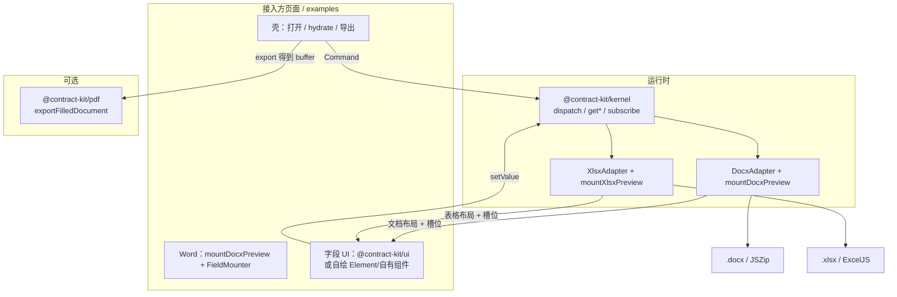
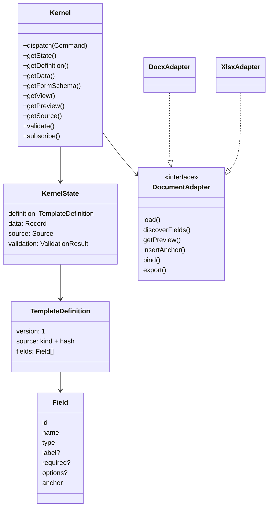
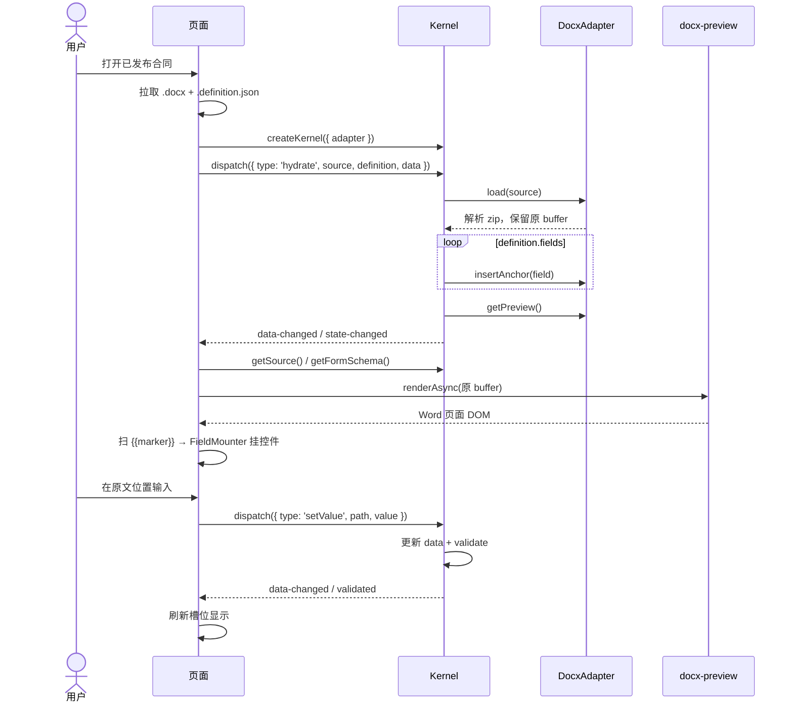
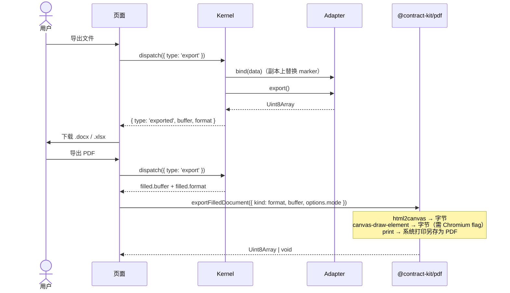
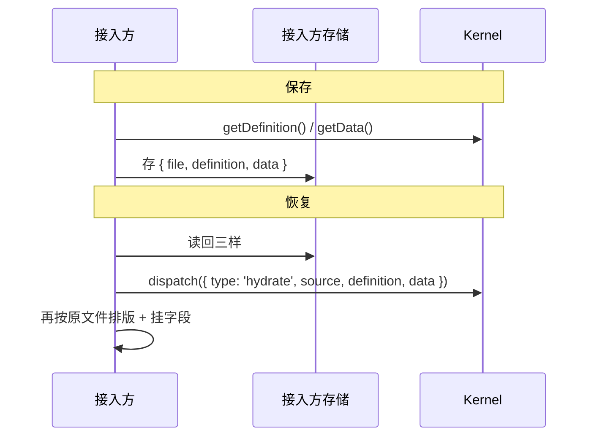

# contract-kit 架构

面向接入方的公共 API 清单见 [api.md](./api.md)。

## 一句话

**headless kernel + document adapter + 页面自绘预览/字段 UI（可选原生 ui / pdf）。**

库不做业务系统。页面只通过 `dispatch` / query / `subscribe` 驱动；真相是三样持久化产物，文档文件只是渲染与导出载体。

| 产物 | 谁存 | 说明 |
|------|------|------|
| 原始 `.docx` / `.xlsx` | 接入方 | 不可变模板 |
| `definition`（字段 JSON） | 接入方 | 类型、label、required、options、锚点 |
| `data`（填写 JSON） | 接入方 | 用户填的值 |

预览按原文排版嵌输入框；导出 = `原始文件 ⊕ definition ⊕ data`（在**副本**上 bind，不改原 buffer）。

---

## 包结构

```text
contract-kit/
  packages/
    contract-kit   # 伞包：默认 re-export kernel（子路径见各自 package）
    kernel         # 状态机：Command / State / Schema / View / Preview 缓存
    docx           # Word adapter：扫 {{marker}}、bind、export、getPreview、mountDocxPreview
    xlsx           # Excel adapter：单元格标记、合并预览、bind、export、mountXlsxPreview
    ui             # 可选：框架无关原生 createField / mountField / nativeFieldMounter
    vue / react    # 可选：useContractKit 订阅快照（peer 框架）
    pdf            # 可选（浏览器）：已填写 docx/xlsx → PDF
  examples/
    nuxt-demo      # Nuxt：原生 / + 自定义 /custom；Nitro 模拟 API（:5210）
    mock           # 共用模拟后端数据
    templates      # 采购合同.docx / .xlsx + definition
```

| 包 | 做 | 不做 |
|----|----|------|
| `kernel` | 状态、命令、校验、schema/view、缓存 preview | DOM、框架、解析 OOXML |
| `docx` | load / discoverFields / getPreview(blocks) / bind / export / **`mountDocxPreview` 文档布局** | 存业务 data、字段控件 |
| `xlsx` | load / discoverFields / getPreview(含单元格样式) / bind / export / **`mountXlsxPreview` 表格布局** | 存业务 data、字段控件 |
| `ui` | 原生控件（含 select / multiselect / display / image 选文件）+ `nativeFieldMounter` | 绑死某一框架、文档排版 |
| `vue` / `react` | `useContractKit` 订阅 schema/data/validation | 自绘字段、改 OOXML |
| `pdf` | 浏览器里把**已导出文件**渲成 PDF | 服务端 Office 矢量转换、改 kernel 状态 |
| 页面 | 上传、OSS、权限、注入 FieldMounter | 直接改 zip/OOXML；自绘 Excel 表格 |

---

## 分层总览



**字段 UI 与布局解耦：** Word 用 `mountDocxPreview` 渲原文件并挂槽位；Excel 用 `mountXlsxPreview` 渲表格（含背景/字体色）。接入方只向槽位 `mount` 控件。以上 API 均从 `contract-kit` 导入。

**字段 UI 与 kernel 解耦：** kernel 只产出 `FormSchema`；谁往槽位里 `mount` 控件由接入方决定。`ui` 是默认实现，不是必选。

**PDF 与填写解耦：** 先 `dispatch({ type: 'export' })` 得到填好的 Office 文件，再 `exportFilledDocument({ kind: filled.format, buffer })`。注意 API 用 `kind`，kernel 导出结果字段名是 `format`（二者同义）。

---

## 核心对象



标记语法决定类型：`{{partyA}}` → text，`{{amount:number}}` → number，`{{payMethod:select}}` → select。  
**下拉 options 不写在 Word 里**，写在随模板发布的 `*.definition.json`，填写页用 `hydrate` 恢复。

---

## 命令与只读 API

| Command | 作用 |
|---------|------|
| `load` | 加载文件，扫标记生成 fields |
| `hydrate` | 用已存 definition + data 恢复（已发布模板主路径） |
| `insertField` / `updateField` / `removeField` | 改 definition |
| `setValue` / `setData` / `resetData` | 改填写数据 |
| `export` | bind(data) + 导出新文件 → `{ type:'exported', buffer, format }` |

只读：`getFormSchema`、`getView`、`getPreview`、`getSource`、`validate`、`can`。  
事件：`subscribe` → `state-changed` / `data-changed` / `validated` / …

---

## 时序：打开已发布模板并填写



仅有文件、尚无 definition 时：先 `load`（discoverFields），再上传/合并 definition 后 `hydrate`。

---

## 时序：导出 Office / PDF



PDF 在浏览器侧再次渲染**已 bind 的文件**（docx-preview / 简易表格），不是截填写页上的表单 DOM。

| `mode` | 行为 |
|--------|------|
| `html2canvas`（默认） | DOM 截图 + jsPDF → `Uint8Array` |
| `canvas-draw-element` | WICG html-in-canvas；需开启 flag |
| `print` | `window.print()` →「另存为 PDF」，无字节返回 |

---

## 时序：持久化与恢复



---

## 示例怎么接

| 目录 / 路径 | 说明 |
|-------------|------|
| `examples/nuxt-demo` `/` | 只依赖 `contract-kit`；原生 UI；「校验」→ `kernel.validate()` |
| `examples/nuxt-demo` `/custom` | Element Plus；「校验」→ `el-form` rules |
| `examples/templates` | Word / Excel 全类型模板 |
| `examples/mock` | Nitro API 共用数据 |

本地：`npm run example` → http://localhost:5210

---

## 明确不做

- 在线 Word/Excel 编辑器  
- 用户 / 租户 / 审批 / OSS  
- 把填写结果只写进文档当唯一真相  
- 老格式 `.doc` / `.xls`  
- 服务端「正宗 Office → PDF」引擎（`pdf` 包是浏览器方案）

## 待办

库自身缺口（不含 ExcelJS / docx-preview / html2canvas 等第三方上限）：

- [x] **Word 布局 API**：`mountDocxPreview`（docx-preview 版式 + 槽位水合）；接入方只注入 FieldMounter。
- [x] **image bind / 导出嵌图**：data URL → Word `w:drawing` / Excel 单元格图。
- [x] **可扩展校验**：`Field.rules`（min/max/长度/正则/日期）+ `createKernel({ validators })` 跨字段。
- [x] **锚点写回文档**：`insertField` 在 Word 文末 / Excel 新行写入 `{{name}}`；`updateField` 改标记；`removeField` 删标记。
- [x] **预览与导出一致**：填写页（原文件+槽位）与 `export`（文本替换+扩行+嵌图）对齐；未填扁平标记导出清空；空表两边各留一行占位。版式仍受 docx-preview / ExcelJS 第三方上限约束。
- [x] **表格行 API**：`insertRow` / `removeRow`；空表预览/导出保留一行空白占位（UI 仍可由业务做）。
- [x] **接入面**：`@contract-kit/vue` / `react` 的 `useContractKit`；`toPersistBundle` / `hydrateFromBundle` / `snapshotKernel`；SSR 边界见 api.md；umbrella 子路径 + [CHANGELOG](../CHANGELOG.md)。

已完成：

- [x] **循环明细表**：`{{items.col}}` 行模板 + `data.items[]`；docx/xlsx bind 扩行；预览按 data 行数渲染（空表一行占位）；行数由 `insertRow` / `removeRow` / `setValue` 控制。
- [x] **Nuxt 示例**：`npm run example`（`/` 原生 UI + `/custom` Element Plus）。
- [x] **Excel 布局进 xlsx**：`mountXlsxPreview` + `getPreview` 单元格颜色。
- [x] **Word 布局进 docx**：`mountDocxPreview`（demo `DocxLayout` 仅为薄宿主）。
