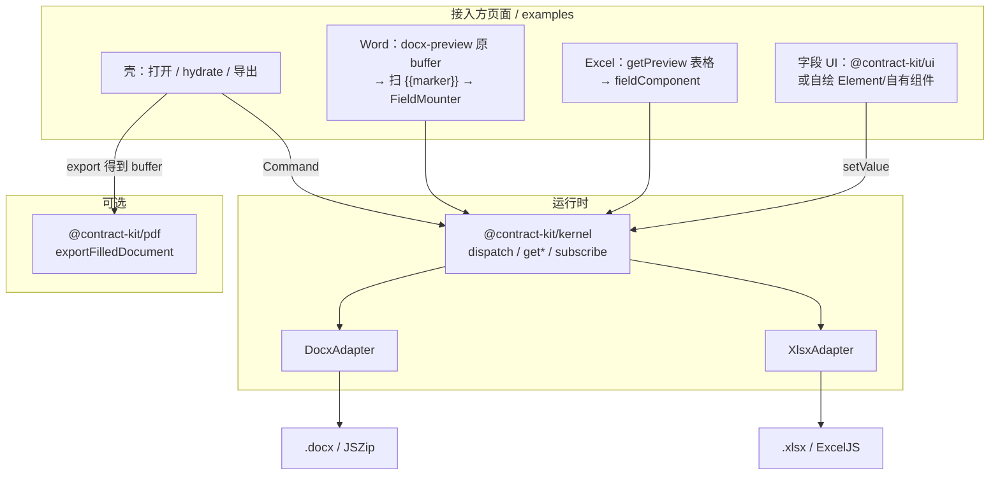
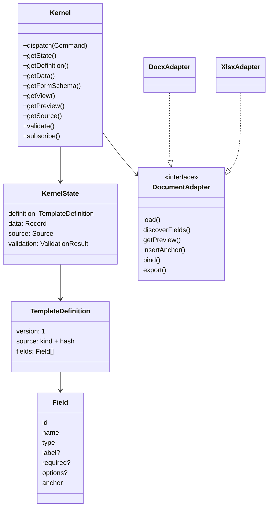
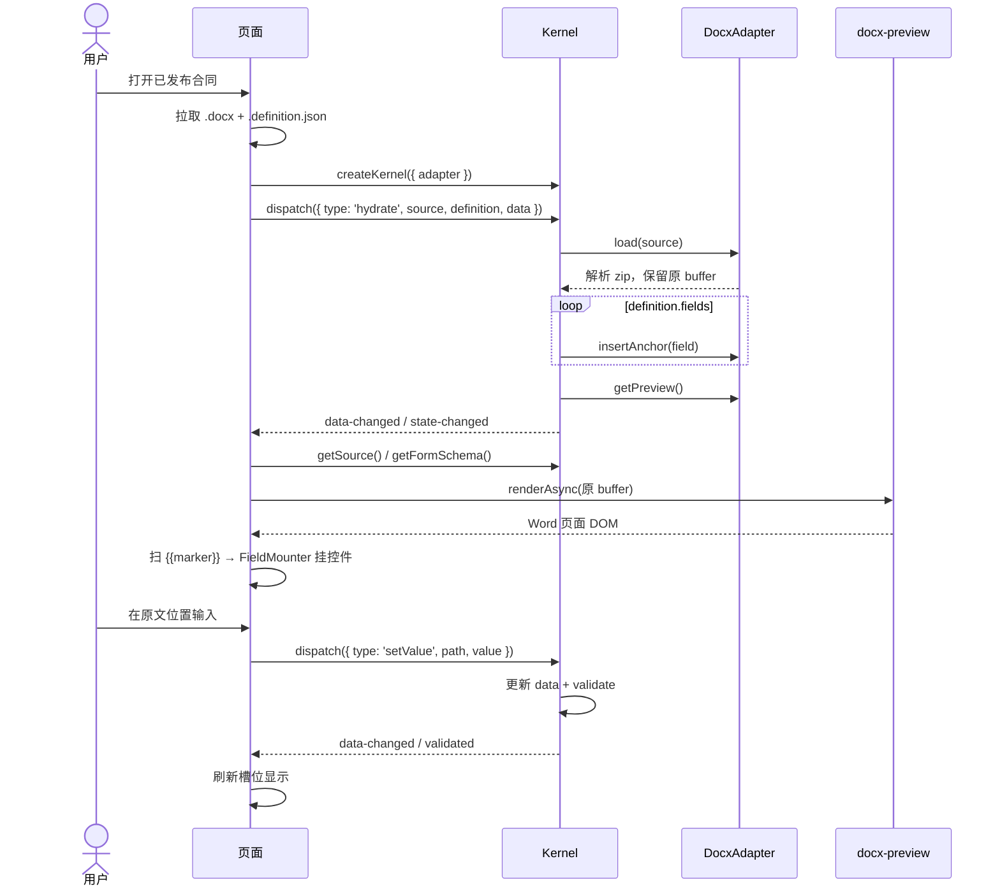
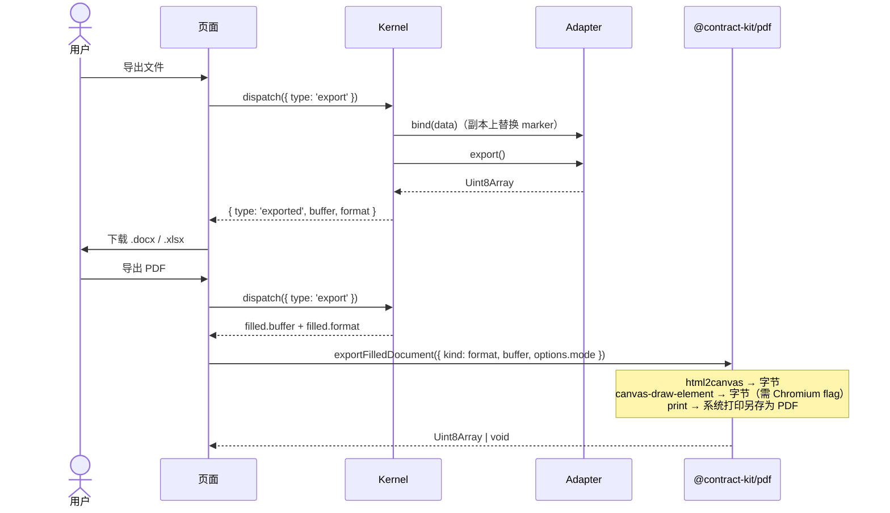
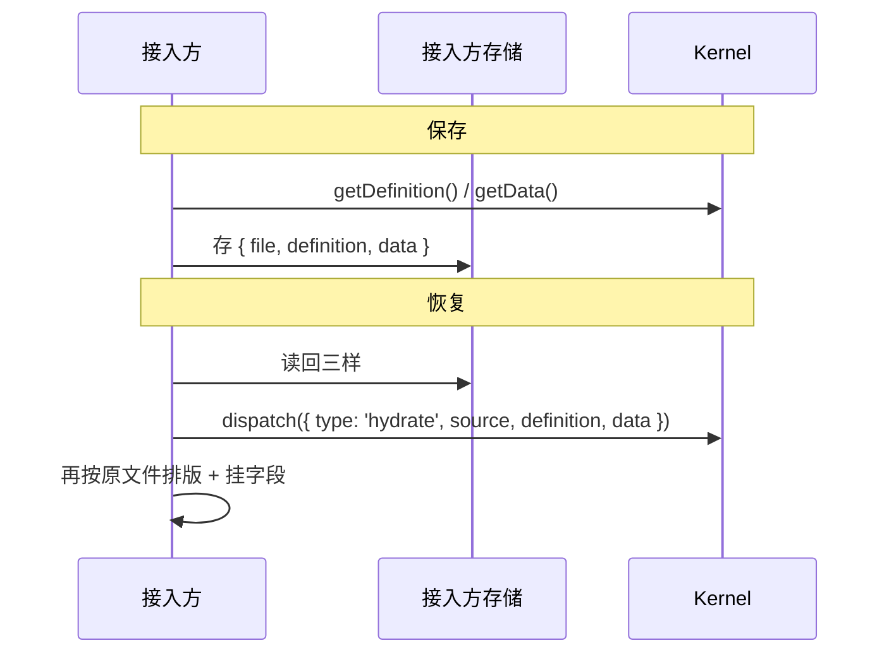

# contract-kit 架构

面向接入方的公共 API 清单见 [api.md](./api.md)。

## 一句话

**headless kernel + document adapter + 页面自绘预览/字段 UI（可选原生 ui / pdf）。**

库不做业务系统。页面只通过 `dispatch` / query / `subscribe` 驱动；真相是三样持久化产物，文档文件只是渲染与导出载体。

| 产物 | 谁存 | 说明 |
|------|------|------|
| 原始 `.docx` / `.xlsx` | 接入方 | 不可变模板 |
| `definition`（字段 JSON） | 接入方 | 类型、label、required、options、锚点 |
| `data`（填写 JSON） | 接入方 | 用户填的值 |

预览按原文排版嵌输入框；导出 = `原始文件 ⊕ definition ⊕ data`（在**副本**上 bind，不改原 buffer）。

---

## 包结构

```text
contract-kit/
  packages/
    contract-kit   # 伞包：默认 re-export kernel（子路径见各自 package）
    kernel         # 状态机：Command / State / Schema / View / Preview 缓存
    docx           # Word adapter：扫 {{marker}}、bind、export、getPreview
    xlsx           # Excel adapter：单元格标记、合并预览、bind、export
    ui             # 可选：框架无关原生 createField / mountField
    pdf            # 可选（浏览器）：已填写 docx/xlsx → PDF
  examples/
    shared         # useContract、DocxLayout（注入 FieldMounter）、XlsxDocument
    native-ui      # @contract-kit/ui 原生字段（:5199）
    custom-ui      # Element Plus 自绘字段（:5200）
    templates      # 采购合同 + *.definition.json 生成脚本
```

| 包 | 做 | 不做 |
|----|----|------|
| `kernel` | 状态、命令、校验、schema/view、缓存 preview | DOM、框架、解析 OOXML |
| `docx` / `xlsx` | load / discoverFields / getPreview / bind / export | 存业务 data、画 UI |
| `ui` | 原生 input/select/textarea/date | Vue/React/Element 绑定 |
| `pdf` | 浏览器里把**已导出文件**渲成 PDF | 服务端 Office 矢量转换、改 kernel 状态 |
| 页面 | 上传、OSS、权限、预览排版、字段控件 | 直接改 zip/OOXML |

---

## 分层总览



**字段 UI 与 kernel 解耦：** kernel 只产出 `FormSchema`；谁往槽位里 `mount` 控件由接入方决定。`ui` 是默认实现，不是必选。

**PDF 与填写解耦：** 先 `dispatch({ type: 'export' })` 得到填好的 Office 文件，再 `exportFilledDocument({ kind: filled.format, buffer })`。注意 API 用 `kind`，kernel 导出结果字段名是 `format`（二者同义）。

---

## 核心对象



标记语法决定类型：`{{partyA}}` → text，`{{amount:number}}` → number，`{{payMethod:select}}` → select。  
**下拉 options 不写在 Word 里**，写在随模板发布的 `*.definition.json`，填写页用 `hydrate` 恢复。

---

## 命令与只读 API

| Command | 作用 |
|---------|------|
| `load` | 加载文件，扫标记生成 fields |
| `hydrate` | 用已存 definition + data 恢复（已发布模板主路径） |
| `insertField` / `updateField` / `removeField` | 改 definition |
| `setValue` / `setData` / `resetData` | 改填写数据 |
| `export` | bind(data) + 导出新文件 → `{ type:'exported', buffer, format }` |

只读：`getFormSchema`、`getView`、`getPreview`、`getSource`、`validate`、`can`。  
事件：`subscribe` → `state-changed` / `data-changed` / `validated` / …

---

## 时序：打开已发布模板并填写



仅有文件、尚无 definition 时：先 `load`（discoverFields），再上传/合并 definition 后 `hydrate`。

---

## 时序：导出 Office / PDF



PDF 在浏览器侧再次渲染**已 bind 的文件**（docx-preview / 简易表格），不是截填写页上的表单 DOM。

| `mode` | 行为 |
|--------|------|
| `html2canvas`（默认） | DOM 截图 + jsPDF → `Uint8Array` |
| `canvas-draw-element` | WICG html-in-canvas；需开启 flag |
| `print` | `window.print()` →「另存为 PDF」，无字节返回 |

---

## 时序：持久化与恢复



---

## 示例怎么接

| 目录 | 字段 UI | 说明 |
|------|---------|------|
| `examples/native-ui` | `@contract-kit/ui` `mountField` | 默认接入 + Definition 配置面板 |
| `examples/custom-ui` | Element Plus + `createElementFieldMounter` | 证明可不依赖 `ui` |
| `examples/shared` | — | `useContract`、DocxLayout、`DefinitionPanel` |
| `examples/templates` | — | `build.ts` → 合同 + `*.definition.json` + `*.definition.alt.json` |

definition 是数据：示例用同一模板切换 default/alt JSON，或 `updateField` 改 label/required 后下载 JSON。

Word：`DocxLayout` 收 `mountField: FieldMounter`。  
Excel：`XlsxDocument` 收 `field-component`。

---

## 明确不做

- 在线 Word/Excel 编辑器  
- 用户 / 租户 / 审批 / OSS  
- 把填写结果只写进文档当唯一真相  
- 老格式 `.doc` / `.xls`  
- 服务端「正宗 Office → PDF」引擎（`pdf` 包是浏览器方案）

## 待办

- [ ] **image 字段**：`FieldType` / `{{name:image}}` 已预留，但尚无 UI 与导出嵌图；需补上传/预览，以及 docx/xlsx `bind` 真正插入图片，并更新 api / README 约定 data 形态（URL / base64 等）。
- [x] **循环明细表**：`{{items.col}}` 行模板 + `data.items[]`；docx/xlsx bind 扩行；预览按业务 data 行数渲染，行内字段可填（行数由业务 `setValue('items', rows)` 控制）。
- [x] **Examples 部署到 GitHub**：`npm run build:examples` → `dist-examples/`；Actions 推 `main`/`v2` 部署 GitHub Pages（`/native/`、`/custom/`）。
